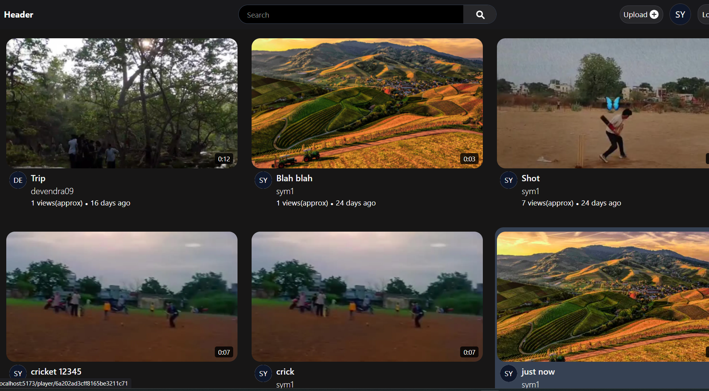
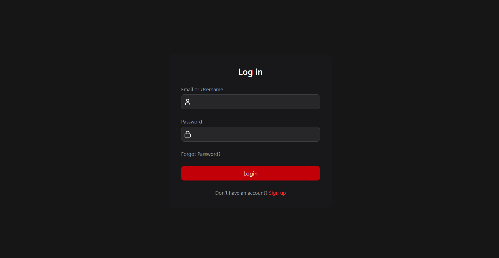
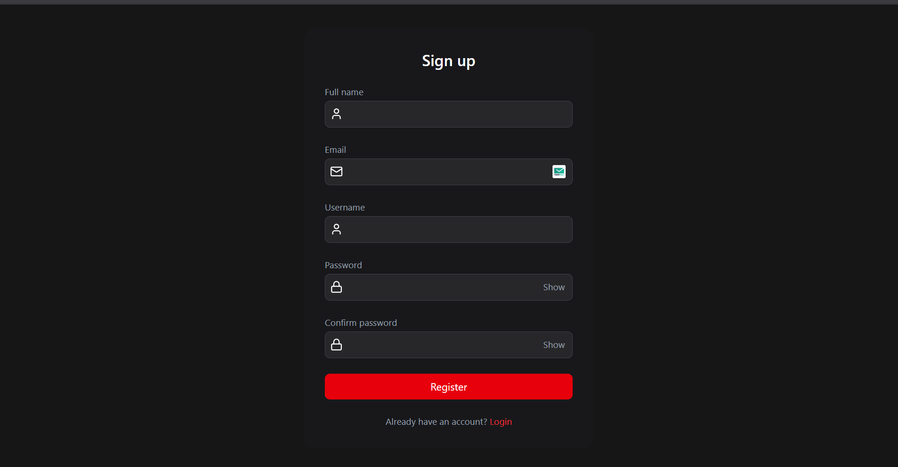
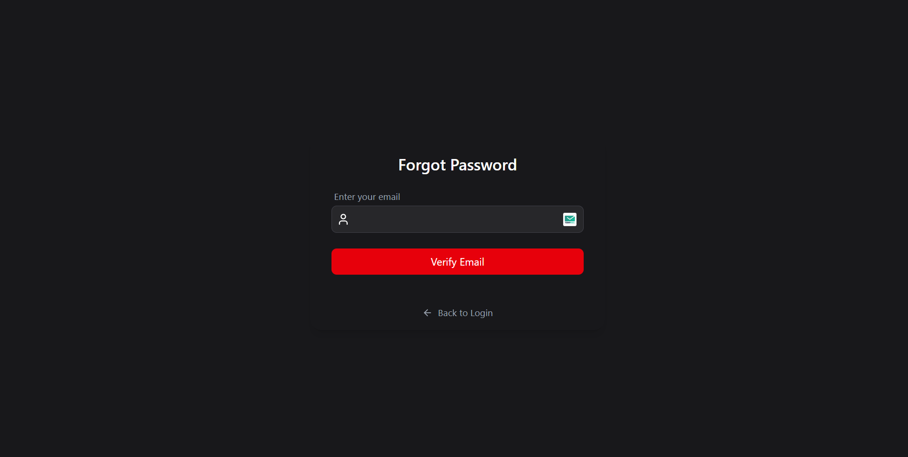
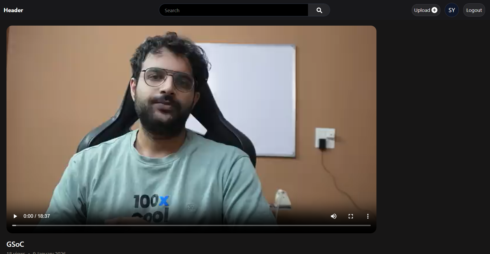
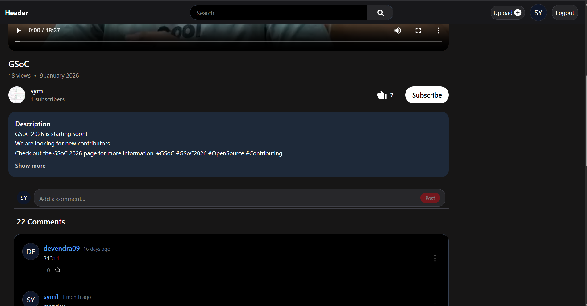
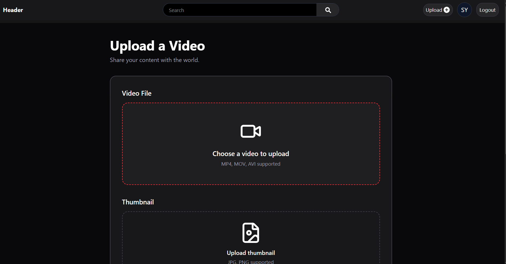
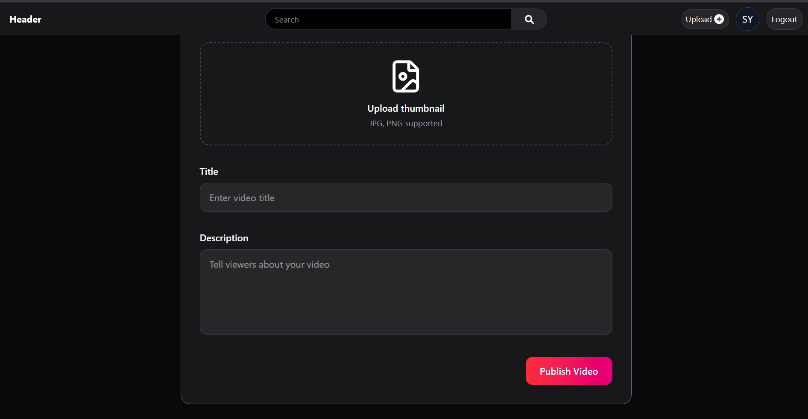

<div align="center">

# 🎥 YouTube Clone

A feature-rich full-stack YouTube-inspired platform built using the **MERN Stack** that replicates core YouTube functionality including authentication, video management, subscriptions, playlists, comments, likes, watch history, and channel management.

Built with a strong focus on **backend architecture**, **secure authentication**, **REST API design**, and **scalable project structure**.


</div>

---

# 🚀 Live Demo

> Coming Soon

---

# 📸 Screenshots

> *(Not completed yet.)*

| Home | Login |
|------|------|
|  |  |

| Sign Up | Forgot Password |
|------|------|
|  |  |

| Video Player | Comments |
|------|------|
|  |  |

| Upload Video | Upload Thumbnail |
|------|------|
|  |  |

---

# 📖 Project Overview

This project recreates the core functionality of YouTube while following modern backend and frontend architecture practices.

Unlike tutorial-level CRUD applications, this project focuses on building a scalable full-stack application with:

- Secure authentication using JWT and Refresh Tokens
- Email verification and password reset
- Modular REST API architecture
- Cloudinary-based media storage
- MongoDB aggregation pipelines
- Layered backend architecture
- Responsive React frontend

---

# ✨ Features

## Authentication

- User Registration
- Login / Logout
- JWT Authentication
- Refresh Token Authentication
- Email Verification
- Forgot Password
- Password Reset
- Protected Routes
- HTTP-only Cookies

---

## User

- Update Profile
- Update Avatar
- Update Cover Image
- View Channel Profile
- Watch History

---

## Videos

- Upload Videos
- Upload Thumbnails
- Video Playback
- Publish / Unpublish Videos
- Update Video
- Delete Video
- Video View Counter

---

## Community

- Like Videos
- Comment System
- Subscribe / Unsubscribe
- Channel Pages

---

## Playlist

- Create Playlist
- Update Playlist
- Delete Playlist
- Add / Remove Videos

---

# 🏗 Architecture

```
                React Frontend
                       │
                       ▼
                React Router
                       │
                       ▼
                  API Layer
                       │
                       ▼
                 Express Routes
                       │
                       ▼
              Authentication Middleware
                       │
                       ▼
                  Controllers
                       │
                       ▼
                 MongoDB Models
                       │
                       ▼
                   MongoDB Atlas
```

---

# 📂 Backend Architecture

```
Backend
│
├── controllers
├── db
├── mail
├── middlewares
├── models
├── routes
├── utils
│
├── app.js
└── index.js
```

### Design Philosophy

The backend follows a layered architecture.

- Routes handle endpoint definitions.
- Middleware handles authentication and preprocessing.
- Controllers contain business logic.
- Models interact with MongoDB.
- Utilities encapsulate reusable functionality such as Cloudinary uploads and API response handling.

---

# 💻 Frontend Architecture

```
Frontend
│
├── api
├── assets
├── components
├── context
├── features
├── hooks
├── pages
├── routeUtils
├── utils
│
├── App.jsx
└── main.jsx
```

The frontend separates UI, routing, API communication, and global state into dedicated modules for better maintainability.

---

# 🔐 Authentication Flow

```
Register
    │
    ▼
Generate Verification Code
    │
    ▼
Send Email
    │
    ▼
Verify Email
    │
    ▼
Login
    │
    ▼
Generate Access Token
Generate Refresh Token
    │
    ▼
HTTP-only Cookies
    │
    ▼
Protected Routes
```

Authentication includes:

- JWT Access Tokens
- Refresh Tokens
- HTTP-only Cookies
- Email Verification
- Password Reset
- Secure Password Hashing using bcrypt

---

# 🗄 Database Design

The application uses MongoDB with normalized collections.

```
User
 │
 ├── Videos
 ├── Playlists
 ├── Tweets
 │
 ├── Likes
 ├── Comments
 └── Subscriptions
```

Collections

- Users
- Videos
- Comments
- Likes
- Playlists
- Subscriptions
- Tweets

Relationships are implemented using MongoDB ObjectId references instead of embedding documents, making the schema scalable and maintainable.

---

# 🌐 REST API Modules

The backend exposes REST APIs for

```
Users

Videos

Comments

Likes

Playlists

Subscriptions

Channels

Tweets

Healthcheck
```

Each module follows REST principles using

```
GET

POST

PATCH

DELETE
```

---

# ☁ Cloud Storage

Media files are uploaded using

- Multer
- Cloudinary

Upload Flow

```
Browser

↓

Express

↓

Multer

↓

Cloudinary

↓

MongoDB
```

---

# 🛠 Tech Stack

## Frontend

- React.js
- React Router
- Tailwind CSS
- Axios
- Context API

## Backend

- Node.js
- Express.js

## Database

- MongoDB
- Mongoose

## Authentication

- JWT
- bcrypt

## Storage

- Cloudinary
- Multer

## Email

- Brevo SMTP

---

# 🚀 Installation

Clone the repository

```bash
git clone https://github.com/symydv/notYetNamed.git
```

Backend

```bash
cd Backend

npm install

npm run dev
```

Frontend

```bash
cd Frontend

npm install

npm run dev
```

---

# 🔑 Environment Variables

Create a `.env` file inside **Backend**

```env
PORT=

MONGODB_URI=

ACCESS_TOKEN_SECRET=
ACCESS_TOKEN_EXPIRY=

REFRESH_TOKEN_SECRET=
REFRESH_TOKEN_EXPIRY=

CLOUDINARY_CLOUD_NAME=
CLOUDINARY_API_KEY=
CLOUDINARY_API_SECRET=

EMAIL_USER=
EMAIL_PASSWORD=

FRONTEND_URL=
```

---

# 📈 What I Learned

This project helped me understand

- Designing scalable REST APIs
- Layered backend architecture
- JWT Authentication
- Refresh Token implementation
- Cloudinary media management
- MongoDB Aggregation Pipelines
- React component architecture
- Context API
- API abstraction
- Secure authentication workflows

---

# 🔮 Future Improvements

- Live Streaming
- Notifications
- Search Suggestions
- Infinite Scroll
- Video Recommendations
- Real-time Chat
- Real-time Notifications
- Docker Deployment
- CI/CD Pipeline
- Unit Testing

---

# 👨‍💻 Author

**Shyam Yadav**

GitHub

https://github.com/symydv

---

If you found this project useful, consider giving it a ⭐.
